# Talk Budget

A mobile-first, AI-native personal finance application.

Architecture follows the system diagram: a Docker Compose `talk-budget-stack`
composed of **postgres-db**, **redis-cache**, a **fastapi-backend** (API
endpoints + SQLAlchemy ORM + auth + AI Agent Gateway) and a **nextjs-frontend**
running on the **Bun** runtime.

## Stack

| Layer          | Tech                                                        |
| -------------- | ----------------------------------------------------------- |
| Backend        | Python 3.11 · FastAPI · SQLAlchemy 2.0 · Alembic            |
| Frontend       | Next.js 14 (App Router) · Bun · TailwindCSS · Lucide React  |
| Database       | PostgreSQL 16                                               |
| Cache          | Redis 7                                                     |
| AI Gateway     | OpenCode API (OpenAI-compatible) · model `deepseek-v4-flash`|
| Orchestration  | Docker & Docker Compose                                     |

## Quick start

```bash
cd talk-budget
cp example.env .env          # then edit .env and add your OPENCODE_API_KEY
docker compose up --build
```

Services:

- Frontend  → http://localhost:3000
- Backend   → http://localhost:8000  (Swagger docs at `/docs`)
- Postgres  → localhost:5433 (mapped to avoid clashing with a host Postgres on 5432)
- Redis     → localhost:6380 (mapped to avoid clashing with a host Redis on 6379)

> The stack also boots without a `.env` file using the safe defaults baked into
> `backend/app/core/config.py`.

## Screenshots

Captured from the running web app (`docker compose up`) with Playwright, at
1440×900 (desktop) and Pixel 5 dimensions (mobile web).

<table>
  <tr>
    <td align="center"><b>Dashboard</b></td>
    <td align="center"><b>Transactions</b></td>
    <td align="center"><b>Wallets</b></td>
  </tr>
  <tr>
    <td>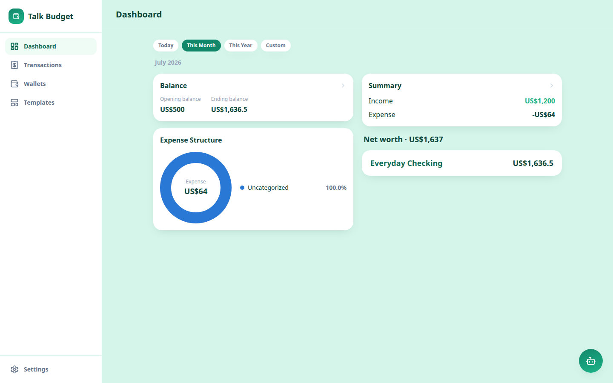</td>
    <td>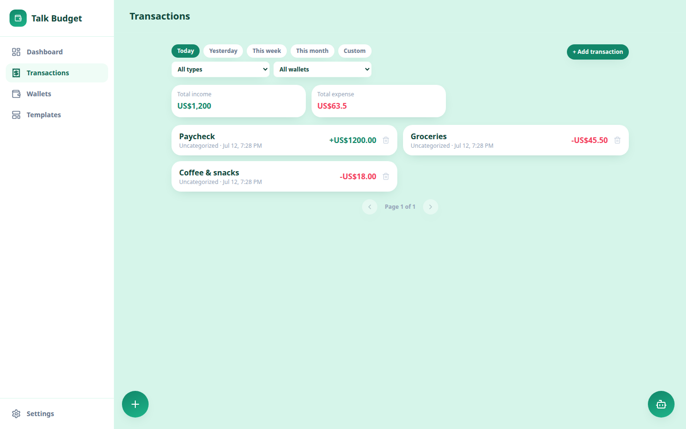</td>
    <td>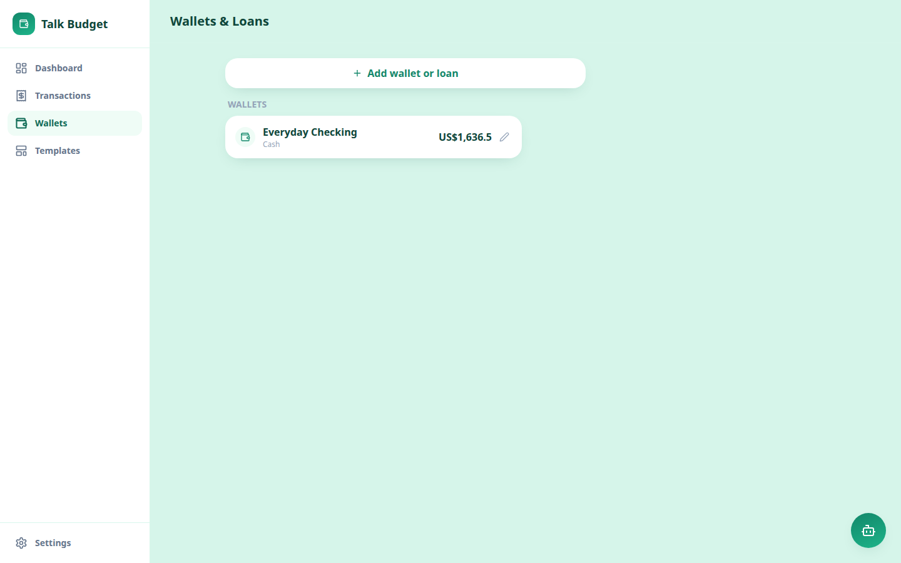</td>
  </tr>
  <tr>
    <td>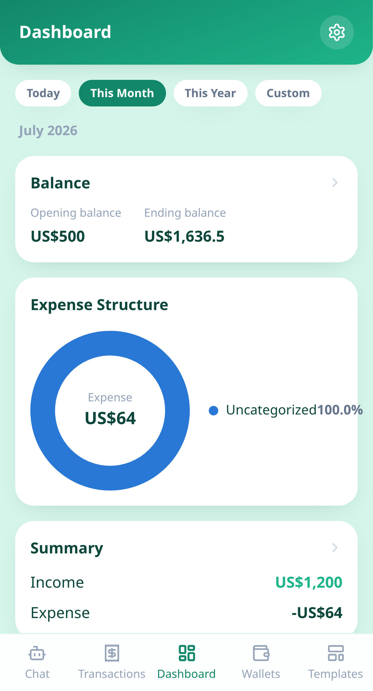</td>
    <td>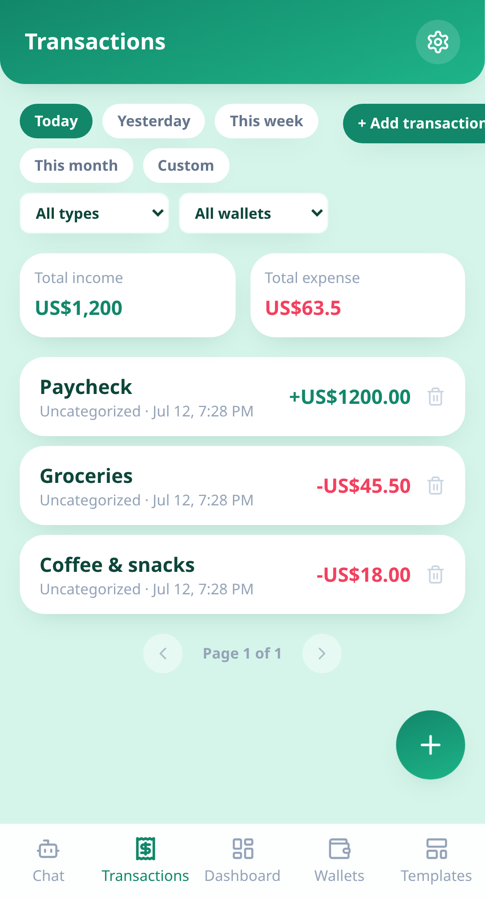</td>
    <td>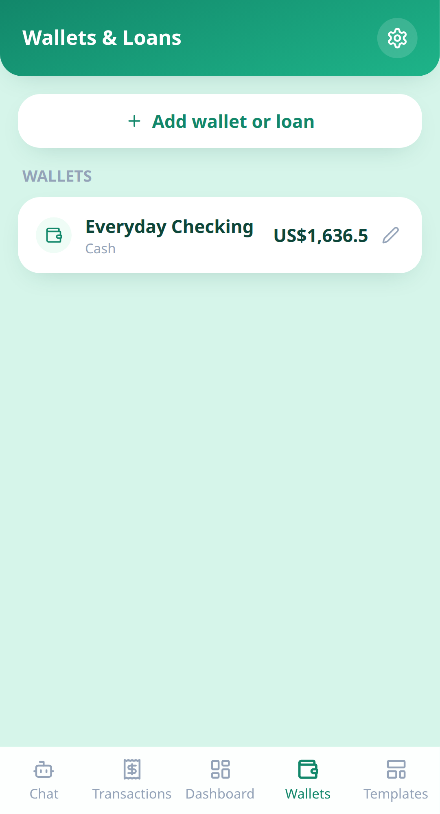</td>
  </tr>
  <tr>
    <td align="center"><b>AI Assistant</b></td>
    <td align="center"><b>Settings</b></td>
    <td align="center"></td>
  </tr>
  <tr>
    <td>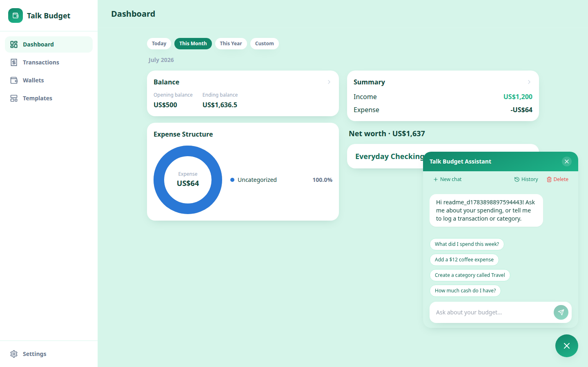</td>
    <td>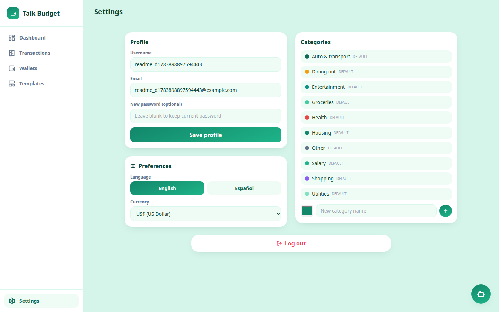</td>
    <td></td>
  </tr>
  <tr>
    <td>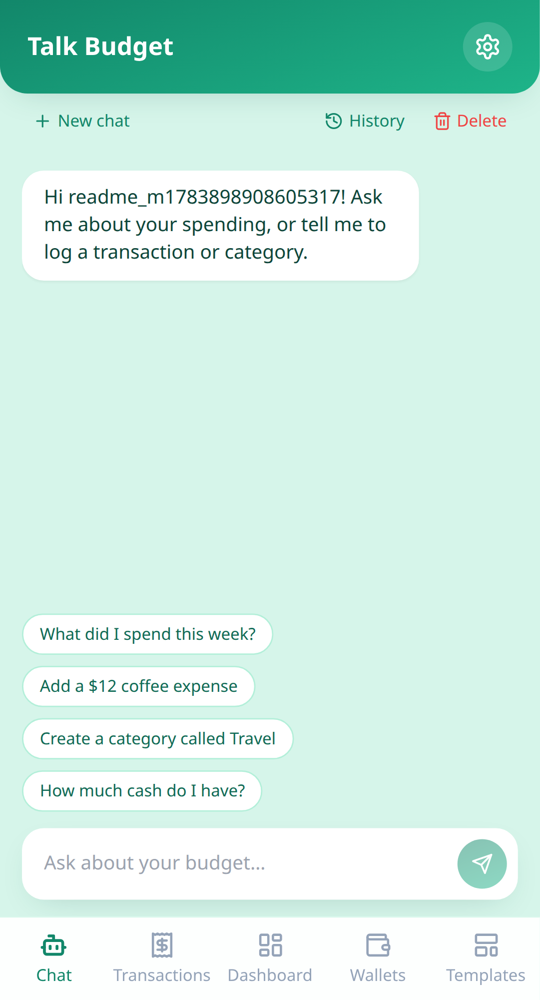</td>
    <td>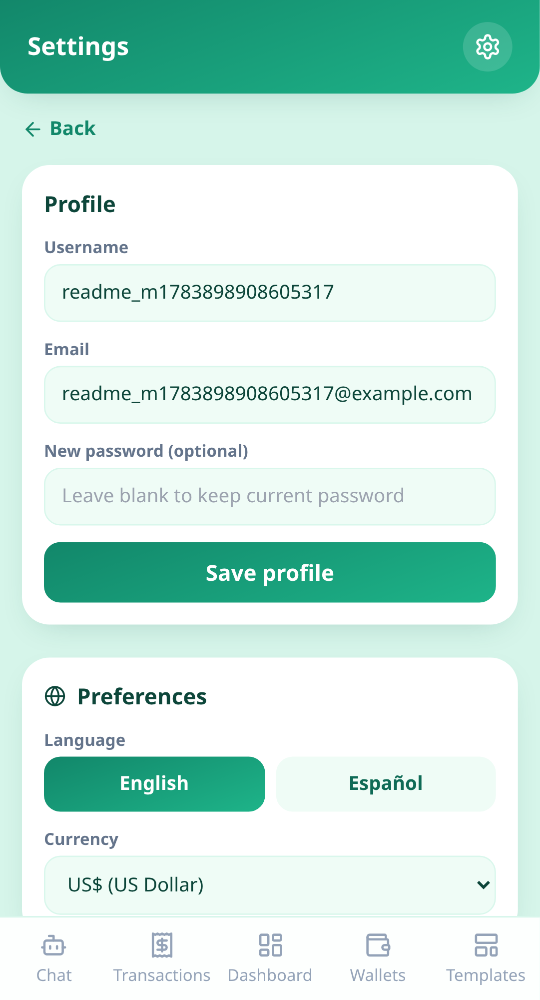</td>
    <td></td>
  </tr>
</table>

### Native app: on-device voice transcription (Android)

The Expo/React Native app in [`mobile/`](mobile/README.md) adds an Android-only
microphone button on the chat screen, backed by the device's native
`SpeechRecognizer` API (`expo-speech-recognition`) — captured below on the
`talkbudget` AVD (Pixel 7, API 34):

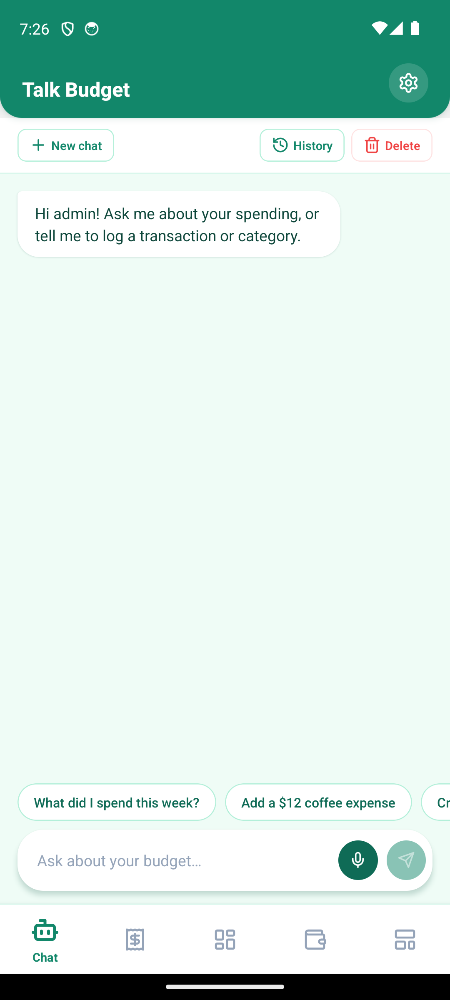

## Mobile app

A native **Expo / React Native** client lives in [`mobile/`](mobile/README.md). It
mirrors the web UI and talks to the same backend. See the
[mobile README](mobile/README.md) for screenshots (design reference), setup, and
how to run it on an Android emulator.

## Authentication & RBAC

JWT-based auth with two roles: `admin` and `user`.

- On startup the backend seeds **exactly one** admin user from
  `ADMIN_USERNAME` / `ADMIN_PASSWORD` (idempotent — skipped if it exists).
- Log in at `/login` with those credentials (defaults: `admin` / `admin123`).
- `POST /api/v1/auth/register` self-registers plain `user` accounts.
- `GET /api/v1/users` is admin-only (RBAC demonstration).

## AI Agent Gateway

`backend/app/services/ai_gateway.py` is the placeholder for the conversational
engine that will later be granted full read/write access to Postgres via the
injected SQLAlchemy session, backed by the OpenCode API (`deepseek-v4-flash`).

## Migrations

Tables are auto-created on startup for convenience. For production-grade schema
management, Alembic is configured under `backend/alembic/`:

```bash
docker compose exec fastapi-backend alembic revision --autogenerate -m "message"
docker compose exec fastapi-backend alembic upgrade head
```

## Layout

```
talk-budget/
├── backend/            # FastAPI service
│   └── app/
│       ├── core/       # config, security (JWT), database session
│       ├── models/     # User, Wallet, Transaction, Category
│       ├── schemas/    # Pydantic schemas
│       ├── api/        # routes + auth middleware (deps.py)
│       └── services/   # AI Agent Gateway + seed/bootstrap
├── frontend/           # Next.js (Bun) mobile-first UI
│   └── src/
│       ├── app/        # App Router pages (login, dashboard)
│       ├── components/ # BalanceHeader, CategoryRow, AccountCard
│       └── lib/        # API fetching utils
├── mobile/             # Expo / React Native app (see mobile/README.md)
└── docker-compose.yml
```
