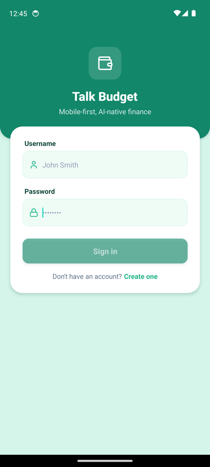
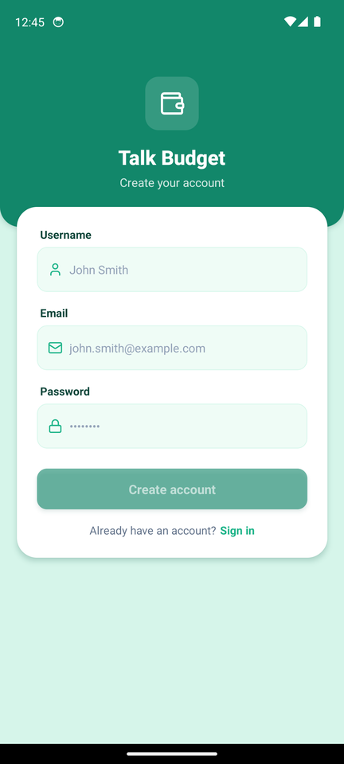
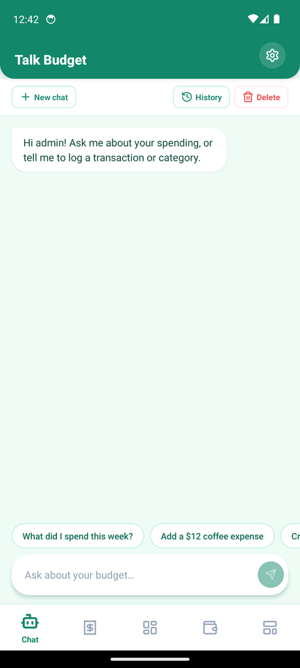
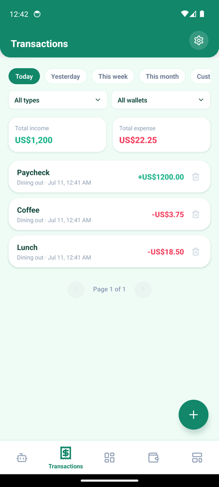
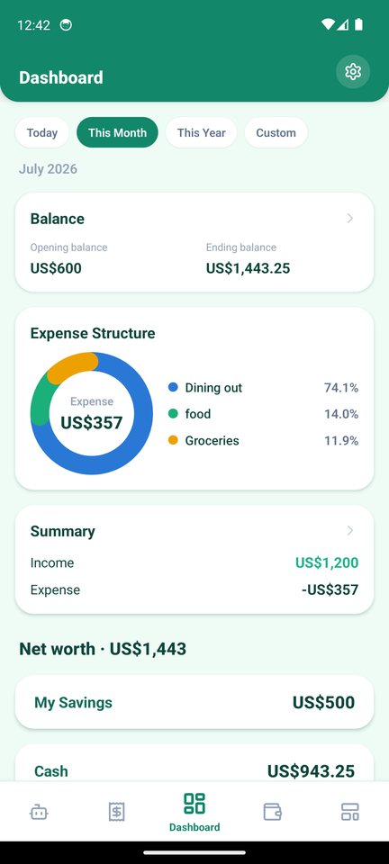
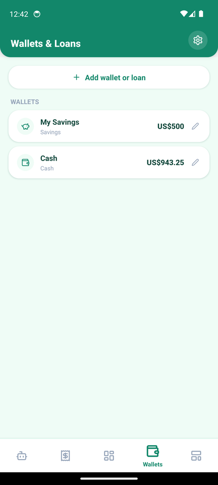
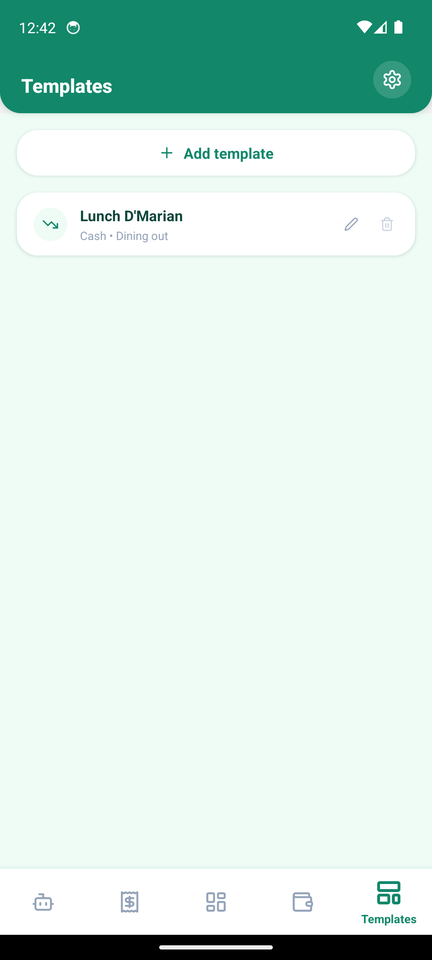
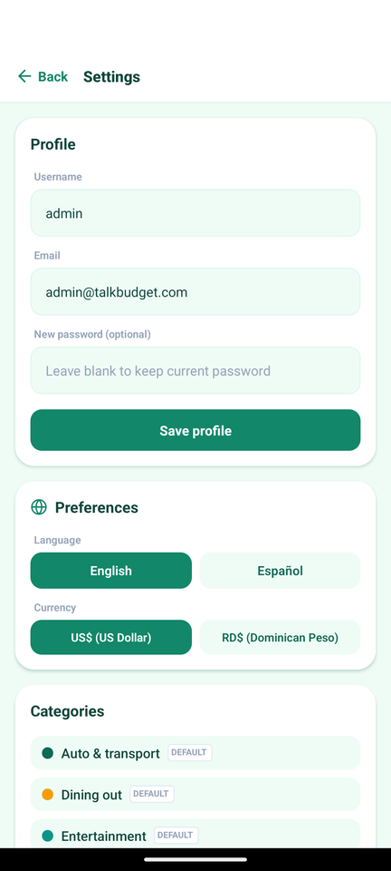

# Talk Budget — Mobile App

A mobile-first **Expo (SDK 51) / React Native** client for Talk Budget. It mirrors
the Next.js web frontend's UI and talks to the same FastAPI backend, sharing the
brand design language (mint canvas, `#12876a` brand green, rounded cards).

## Design reference

Screenshots captured on an Android 14 emulator (Pixel 7). These are the source of
truth for how each screen should look across devices.

### Authentication

<table>
  <tr>
    <td align="center"><b>Login</b></td>
    <td align="center"><b>Register</b></td>
  </tr>
  <tr>
    <td></td>
    <td></td>
  </tr>
</table>

### Main tabs

<table>
  <tr>
    <td align="center"><b>Chat</b></td>
    <td align="center"><b>Transactions</b></td>
    <td align="center"><b>Dashboard</b></td>
  </tr>
  <tr>
    <td></td>
    <td></td>
    <td></td>
  </tr>
  <tr>
    <td align="center"><b>Wallets</b></td>
    <td align="center"><b>Templates</b></td>
    <td align="center"><b>Settings</b></td>
  </tr>
  <tr>
    <td></td>
    <td></td>
    <td></td>
  </tr>
</table>

**Navigation:** the bottom bar shows icon-only tabs; the active tab gets a slightly
larger icon plus its label centered directly beneath it.

## Tech

| Layer         | Tech                                                        |
| ------------- | ----------------------------------------------------------- |
| Framework     | Expo SDK 51 · React Native 0.74 · TypeScript                |
| Navigation    | React Navigation 6 (bottom tabs + stack)                    |
| Icons         | lucide-react-native · react-native-svg                      |
| Storage       | AsyncStorage (JWT), IndexedDB-style offline chat cache      |
| i18n          | English / Spanish, currency USD / DOP                       |

## Getting started

Run from `mobile/` (Bun preferred; Node works as a fallback):

```bash
bun install            # or npm install
bunx expo start        # dev server + QR for Expo Go
bunx expo start --web  # run in the browser (react-native-web)
bunx tsc --noEmit      # typecheck
npx expo-doctor        # project health check
```

The app targets these backend base URLs (see `src/lib/api.ts`):

- **Android emulator** → `http://10.0.2.2:8000/api/v1` (host loopback)
- **iOS / web** → `http://localhost:8000/api/v1`

Start the backend first with `docker compose up` from the repo root.

## Running on an Android emulator (Linux)

An x86_64 emulator needs KVM (hardware virtualization enabled in BIOS). Once
`/dev/kvm` exists:

```bash
# One-time SDK install (user-space, no sudo):
sdkmanager "platform-tools" "emulator" "platforms;android-34" \
           "system-images;android-34;google_apis;x86_64"
avdmanager create avd -n talkbudget \
           -k "system-images;android-34;google_apis;x86_64" -d pixel_7

# Boot + run the app:
emulator -avd talkbudget -gpu swiftshader_indirect &
bunx expo start --android      # installs Expo Go on the emulator and opens the app
```

## Project structure

```
mobile/
├── App.tsx                 # navigation shell, tab bar, brand header, providers
├── src/
│   ├── screens/            # Login, Register, Chat, Transactions, Dashboard,
│   │                       #   Wallets, Templates, Settings
│   ├── components/         # DonutChart, AccountCard, Modal, TransactionForm, …
│   └── lib/                # api client, auth/currency/i18n contexts, date-range
└── docs/screenshots/       # design-reference captures (this README)
```
